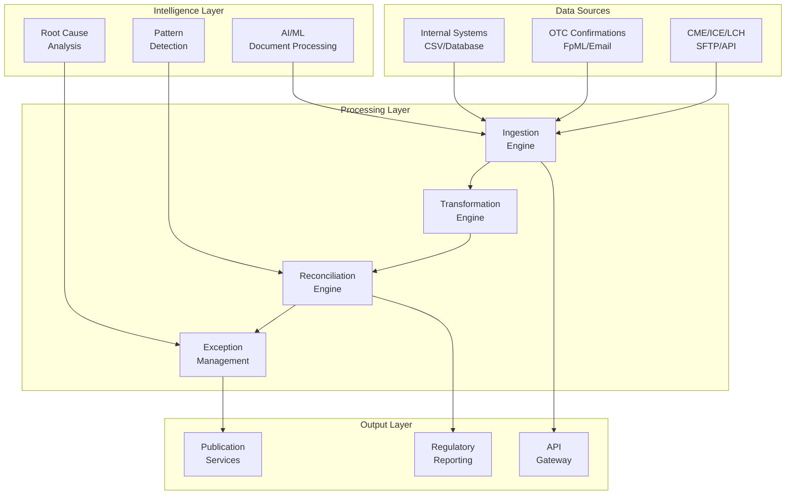

## OpsPilot v1

AI-powered RegTech platform for derivatives post-trade reconciliation and nightly SPAN/risk parameter summaries.

### Product story
OpsPilot automates reconciliation and risk summarization so operations teams resolve breaks faster and regulators get transparent, reproducible lineage. Post-trade volumes are rising while margins compress; teams need explainable automation now. Buyers are heads of Operations, Risk, and Compliance at brokers, FCMs, and buy-side firms.

### Architecture overview
- Frontend: Next.js (App Router, Tailwind)
- Backend: FastAPI (Python), Pandas for matching/diffs, optional AI summaries
- Storage: Local `/tmp` in dev, S3 in prod; Postgres for app config + audit headers
- Ingestion: CSV/SFTP/API adapters, validation via Pydantic (Pandera optional)
- Reports: Exception CSV/PDF stubs, regulator-friendly mode
 - New features: Predictive reconciliation, Margin Impact, Regulator-ready export, N-way recon, Clustering

See `docs/architecture.md` for diagram and flow details.

### Request/response flows
- Reconciliation
  - Request: Upload internal/cleared files → `/upload` → `/reconcile`
  - Response: JSON with match stats, exceptions, severity, cluster hints; CSV export via `/reports/exception`
- SPAN/Risk
  - Request: Upload SPAN file → `/upload` → `/risk/changes`
  - Response: JSON diff vs yesterday + concise narrative summary

### AI usage (human-in-the-loop)
- Summaries and explanations only; never auto-change books/records
- Every AI output is attributable with provenance in Regulator Mode
- Can be disabled via `AI_ENABLED=false` (rule-based fallback)

### Security posture
- Encryption in transit (HTTPS assumed) and designed for encryption at rest (KMS in prod)
- Role-based access control (stubbed) and least-privilege IAM (Terraform stubs)
- Structured audit logs with correlation IDs and hash-chain integrity
- Retention knobs for uploads, processed artifacts, and logs

### Dev quickstart
Requirements: Docker, Docker Compose.

```bash
docker-compose up --build
```

- Frontend: http://localhost:3000
- Backend: http://localhost:8000/docs
- Metrics: http://localhost:8000/metrics

Run DB migration (optional but recommended for audit headers):
```bash
docker compose exec backend bash -lc "alembic upgrade head"
```

Start background worker (optional for async tasks):
```bash
docker compose up -d worker
```

Set envs in `frontend/.env.local` (copy from `.env.local.example`).

### Feature matrix

| Module | v1 | Notes |
|-------|-----|-------|
| ETD reconciliation | ✅ | 1,000+ trades in <30s (dev), exceptions clustering |
| OTC parsing | ✅ (stub) | FpML parsing surface; tolerance-based match |
| SPAN/Risk changes | ✅ | Nightly parse + diff + alerts |
| Exception workflow | ✅ (MVP) | SLA tiers, bulk actions (UI stubs) |
| Audit & lineage | ✅ | JSONL structured logs, correlation IDs |
| Reports | ✅ | Exception CSV; PDF stub; Regulator Mode notes |
| Predictive reconciliation | ✅ (demo) | Logistic regression model, synthetic fallback |
| Margin impact | ✅ (demo) | IM delta approx via SPAN params |
| Regulator-ready export | ✅ (demo) | ZIP with CSVs and lineage snapshot |
| N-way reconciliation | ✅ (demo) | Authoritative order + tolerances |
| Clustering | ✅ (demo) | Cosine similarity-based naive clustering |
| Multi-asset expansion | 🔜 | Pluggable parsers for Crypto/FX |
| RBAC/Auth | 🔜 | Add Auth0/Clerk integration |

### Extensibility
- Parsers: Add new adapters under `backend/app/ingestion/` and map to `schemas_cdm.py`
- Recon rules: Extend `backend/app/recon/` modules (matchers, diff, severity)
- Reports: Implement new generators under `backend/app/reports/`
- Infra: Fill in Terraform under `infra/terraform` and wire CI/CD
 - Workers: Toggle `USE_CELERY=true` in backend env to run heavy jobs via Celery; see `worker` service

# Derivatives Data Automation Platform - MVP


A derivatives-first data automation platform inspired by [Duco's proven pillars](https://du.co/) - extraction, transformation, reconciliation, exception management, and controlled publishing - specifically tailored for ETD and OTC derivatives workflows.

## 🎯 Vision & Positioning

**Transform derivatives operations** by automating the complete data lifecycle from ingestion through reconciliation to exception resolution, reducing manual effort by >50% while maintaining 100% audit compliance.

### Core Pillars (Inspired by Duco)
- **🔄 Extract**: Automated ingestion from brokers, CCPs, and internal systems
- **⚡ Transform**: Template-driven mapping to canonical derivatives model  
- **🎯 Reconcile**: Multi-way matching with derivatives-specific logic
- **🔍 Manage Exceptions**: Intelligent break detection and resolution workflows
- **📤 Publish**: Controlled distribution to downstream systems with audit trails
- **🛡️ Govern**: Complete security, compliance, and audit capabilities

## 📊 Market Focus

### Primary Users
- **Operations Analysts**: Capital markets operations (clearing, confirmations, reconciliations)
- **Middle Office**: Trade settlement and lifecycle management  
- **Risk & Compliance**: Regulatory reporting and margin management

### Initial Segment
- **Buy-side**: Hedge funds and asset managers
- **Sell-side**: Smaller brokers and proprietary trading firms
- **Product Focus**: ETD (Exchange-Traded Derivatives) + vanilla OTC (IRS, FX)

## 🚀 MVP Scope & Success Metrics

### Target KPIs
| Metric | Target | Impact |
|--------|--------|---------|
| **ETD Match Rate** | >90% | Automated position reconciliation |
| **OTC Match Rate** | >80% | Trade economics validation |
| **Document Accuracy** | >70% | AI-powered extraction |
| **Resolution Time** | <1 day median | Exception handling efficiency |
| **Manual Effort Reduction** | >50% | Operational productivity |

### Supported Venues
- **CME Group**: Futures, Options, Cash flows
- **LCH**: SwapClear, ForexClear
- **ICE**: Futures, Credit derivatives  
- **Eurex**: Fixed income, Equity derivatives
- **OTC**: FpML confirmations, vanilla IRS/FX

## 📚 Documentation

### Core Documents
- **[MVP Plan](MVP_PLAN.md)**: Complete business requirements and scope
- **[Architecture](ARCHITECTURE.md)**: Technical architecture and system design
- **[Data Model](data_model_schemas.md)**: Comprehensive derivatives data schemas
- **[Project Structure](project_structure.md)**: Code organization and module design
- **[Implementation Roadmap](IMPLEMENTATION_ROADMAP.md)**: 12-week delivery plan

### Key Features

#### 🔧 **Ingestion Layer**
- SFTP/API connectors for major venues
- Multi-format parsing (CSV, XML, FpML, FIXML)
- AI-powered document processing (OCR + LLM)
- Real-time validation and quality checks

#### ⚙️ **Transformation Engine**  
- Template-driven field mapping
- Canonical derivatives data model
- Reference data enrichment
- Configurable validation rules

#### 🎯 **Reconciliation Engine**
- ETD position reconciliation (Internal vs Broker)
- OTC trade economics matching  
- N-way reconciliation (Internal vs Broker vs CCP)
- Configurable tolerance handling

#### 🔍 **Exception Management**
- Intelligent break detection and clustering
- Root cause analysis with AI suggestions
- Collaborative resolution workflows
- SLA tracking and escalation

#### 📤 **Publication & Integration**
- Multiple export formats (CSV, Excel, JSON, XML)
- Real-time webhooks and API feeds
- Regulatory compliance packages
- Audit trail and lineage tracking

## 🏗️ Architecture Overview

### Technology Stack
- **Backend**: Python 3.11+ with FastAPI
- **Database**: PostgreSQL 15+ with Redis caching
- **Queue**: Celery for distributed task processing
- **Frontend**: React 18 + Next.js 13
- **Storage**: S3-compatible object storage
- **Deployment**: Docker + Kubernetes
- **Monitoring**: Prometheus + Grafana

### System Architecture



## 📈 Implementation Timeline

### 12-Week Sprint Plan

| Sprint | Weeks | Focus | Key Deliverables |
|--------|-------|-------|------------------|
| **Sprint 1** | 1-2 | Foundation | Core models, API framework, authentication |
| **Sprint 2** | 3-4 | Ingestion | File processing, format parsing, validation |
| **Sprint 3** | 5-6 | Transformation | Template mapping, reference data, normalization |
| **Sprint 4** | 7-8 | Reconciliation | Matching algorithms, tolerance handling, break detection |
| **Sprint 5** | 9-10 | Exceptions | Workflow management, AI analysis, resolution UI |
| **Sprint 6** | 11-12 | Intelligence & Publication | Advanced IDP, export services, compliance |

### Team Structure (7.5 FTE)
- **Product Lead** (1.0): Requirements, stakeholder management
- **Backend Engineers** (2.0): API development, business logic
- **Data/Recon Engineer** (1.0): Reconciliation algorithms, performance
- **Frontend Engineer** (1.0): UI/UX, dashboard development
- **ML Engineer** (0.5): Document processing, AI models
- **DevOps/SRE** (0.5): Infrastructure, deployment, monitoring
- **QA Engineer** (0.5): Testing, quality assurance, UAT

## 💰 Investment & Budget

### Total MVP Investment: **$227,700** (12 weeks)
- **Team Costs**: $208,800 (7.5 FTE × 12 weeks)
- **Infrastructure**: $18,900 (Cloud, tools, services)

### Expected ROI
- **Cost Savings**: >50% reduction in manual reconciliation effort
- **Risk Reduction**: Automated compliance and audit trails
- **Scalability**: Foundation for multi-client SaaS expansion
- **Time to Market**: 12-week MVP vs 6-12 month traditional approach

## 🔒 Security & Compliance

### Regulatory Readiness
- **EMIR**: Field completeness, UTI/UPI tracking, lifecycle events
- **CFTC Part 45**: Reporting validation, real-time readiness
- **MiFIR**: Transaction reporting, instrument classification
- **SOC 2**: Security, availability, processing integrity controls

### Security Controls
- **Zero Trust Architecture**: No implicit trust, verify everything
- **End-to-End Encryption**: TLS 1.3 in transit, AES-256 at rest
- **Role-Based Access Control**: Granular permissions and audit
- **Immutable Audit Trail**: Complete lineage and change history

## 🎯 Next Steps

### Immediate Actions (Week 1)
1. **✅ Stakeholder Alignment**: Confirm pilot scope with business sponsors
2. **🔐 Environment Setup**: Provision cloud infrastructure and development environments  
3. **📊 Data Collection**: Secure 10+ days of sample data from target venues
4. **👥 Team Assembly**: Finalize team assignments and start dates
5. **🛠️ Tool Selection**: Confirm technology stack and third-party services

### Success Criteria for Go-Live
- ✅ **Technical**: All KPI targets met, security validated, performance optimized
- ✅ **Business**: User acceptance >80%, operational procedures validated
- ✅ **Compliance**: Audit trail complete, regulatory requirements met

### Phase 2 Vision (Post-MVP)
- **Multi-Tenant SaaS**: Scale to multiple clients
- **Advanced Analytics**: ML-powered insights and predictions  
- **Global Expansion**: Additional venues and asset classes
- **Real-Time Processing**: Stream processing for immediate reconciliation

## 📞 Contact & Support

### Project Leadership
- **Product Lead**: [To be assigned]
- **Technical Lead**: [To be assigned]
- **Business Sponsor**: [To be confirmed]

### Getting Started
1. Review the **[MVP Plan](MVP_PLAN.md)** for detailed requirements
2. Study the **[Architecture](ARCHITECTURE.md)** for technical specifications
3. Examine the **[Implementation Roadmap](IMPLEMENTATION_ROADMAP.md)** for delivery timeline
4. Contact the project team for pilot participation

---

**Inspired by**: [Duco's platform pillars](https://du.co/) - proven extraction, transformation, reconciliation, exception management, and controlled publishing capabilities, specifically adapted for derivatives market workflows.

**Last Updated**: [Current Date]  
**Version**: 1.0 MVP Design  
**Next Review**: Week 4 of implementation
