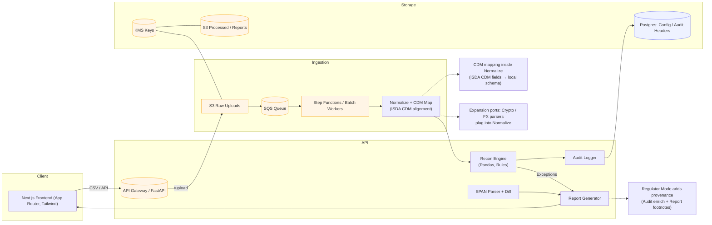

## OpsPilot v1 Architecture

This document describes the v1 architecture for OpsPilot — an AI-powered RegTech platform that automates derivatives post-trade reconciliation and nightly SPAN/risk parameter summaries.

### System Diagram

### Numbered Data-Flow Walk‑Through
1. Upload: Users upload ETD/OTC trade and risk files via the Next.js UI. Files are POSTed to the FastAPI `/upload` endpoint. In production, the API streams to S3 Raw with KMS encryption.
2. Ingestion Queue: An SQS message (metadata only) triggers Step Functions/Workers to validate, normalize, and map ingested data to the ISDA CDM-aligned local schema.
3. Normalization + CDM Map: Parsers (CSV/SFTP/API) apply schema validation (Pydantic/Pandera) and map into CDM-correlated models (`Trade`, `Position`, `LifecycleEvent`). Crypto/FX adapters plug in here.
4. Reconciliation: The Recon Engine (Pandas + rule-based logic) matches by `trade_id` or composite keys, calculates diffs with product-aware tolerances, clusters exceptions, and scores severity.
5. Risk / SPAN: Nightly SPAN parameters are parsed and diffed vs yesterday; alerts and narratives are generated for human review.
6. Exception Workflow: Exceptions are exposed via the API and UI with filters, bulk actions, and SLA metadata. Postgres stores audit headers and workflow metadata; artifacts go to S3 Processed.
7. Audit Trail: All actions write structured JSONL audit events with correlation IDs and hash-chain linkage. Regulator Mode enriches events with provenance and data lineage.
8. Reports: Exception CSV/PDF and regulator-friendly summaries are generated on demand. Reports and processed artifacts are stored in S3 with KMS; links are surfaced to the UI.
9. Security: Encryption in transit (TLS) and at rest (KMS), least-privilege IAM, and explicit retention knobs across buckets and logs.

### Deployment Options
- Single-tenant vs Multi-tenant: Start single-tenant. For multi-tenant, isolate S3 prefixes, SQS queues, and optionally DBs per tenant. See `docs/ADR/ADR-002_multitenancy.md`.
- Serverless vs Containerized: API via containers (ECS/EKS) or serverless (Lambda + API Gateway). Batch/Step Functions for scalable ingestion/recon.

### Expansion Points
- New parsers: add `backend/app/ingestion/<source>.py` and map to CDM models
- Crypto/FX connectors: plug into Normalize with format-specific readers and shared CDM mapping
- Reports: extend `backend/app/reports` with PDF/CSV generators (Regulator Mode annotations)

